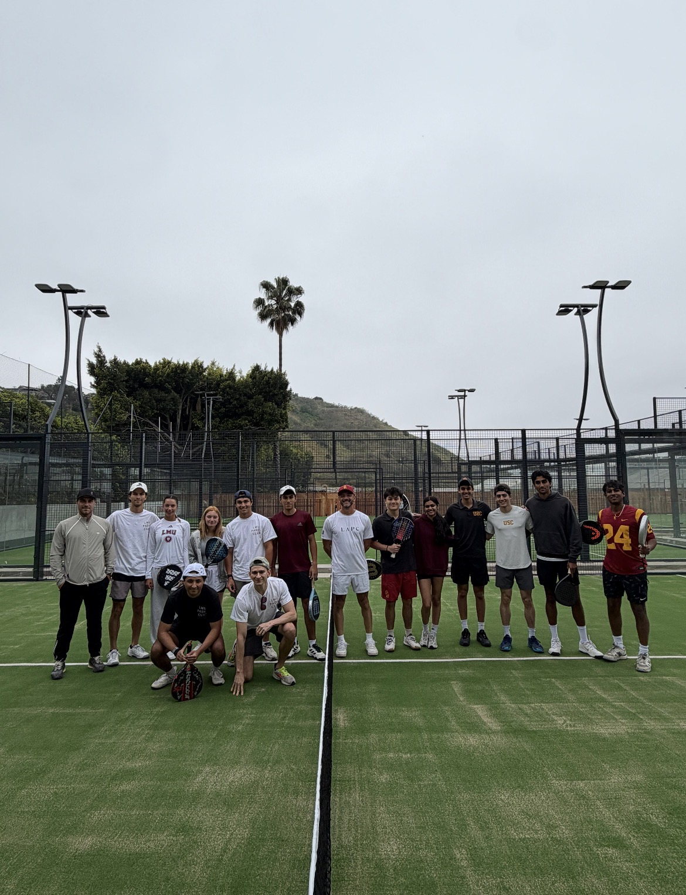

## Campus Leadership
### BCLA Dean’s Student Advisory Board

**Member & Co-head of Events | 2025/2026 to Present**

Represent student perspectives and serve as a liaison between the student body and the Dean’s Office.

{fig-alt="BCLA Dean’s Student Advisory Board members with Nancy Pelosi" width=100%}

## Research Experience

### Institute for Leadership Studies, LMU

**Political Science Research Assistant | Professor Michael Genovese**

Assist Professor Michael Genovese with political science research at LMU’s Institute for Leadership Studies.

### LMU Padel Club

**Co-Founder, Co-President & Treasurer | 2025/2026 to Present**

Founded and grew the club to over 60 members. Manage a budget of over $2,000 and oversee club operations.

{fig-alt="LMU Padel Club playing against the University of Southern California" width=60% fig-align="center"}
