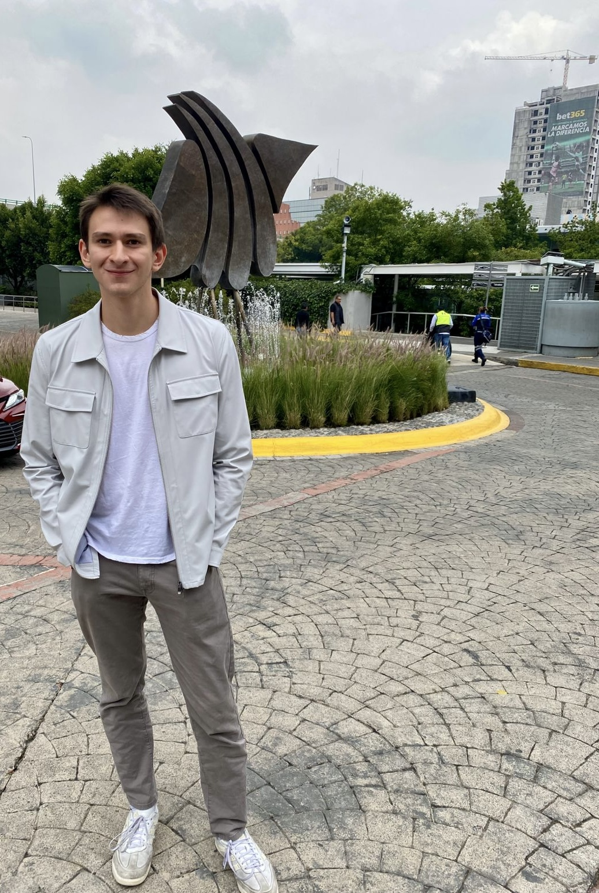

```{=html}
<style>
.hero-photo {
  display: flex;
  flex-direction: column;
  align-items: center;
}

.hero-photo h2 {
  margin-top: 20px;
  margin-bottom: 8px;
  font-size: 1.5rem;
  text-align: center;
}

.profile-icons {
  display: flex;
  justify-content: center;
  gap: 18px;
  align-items: center;
  margin-top: 12px;
}

.profile-icons a {
  display: inline-flex;
  align-items: center;
  justify-content: center;
  padding: 8px;
  color: #315e50;
  border-radius: 8px;
  transition: background 0.2s;
}

.profile-icons a:hover,
.profile-icons a:focus-visible {
  background: #edf3ef;
}

.hero-photo .profile-icons img,
.hero-photo .profile-icons svg {
  width: 28px;
  height: 28px;
  max-width: none;
  border-radius: 0;
  margin: 0;
  aspect-ratio: auto;
  object-fit: contain;
  display: block;
}
</style>
```

:::: {.home-hero}

::: {.hero-copy}

[STUDENT & RESEARCHER]{.eyebrow}

# Mateo Aliaga {.display-name}

[Making sense of the social world.]{.hero-subtitle}

I'm an undergraduate student at Loyola Marymount University studying political science and economics, with a focus on applied data science.

I'm interested in politics, public opinion, and local government, and in how I can use data and research methods to deepen my understanding and improve my work.

This is a place for my projects, the questions I'm working through, and a few notes from beyond the classroom.

[Explore my research](research.qmd){.primary-link}

:::

::: {.hero-photo}

{fig-alt="Portrait of Mateo Aliaga"}

## Connect

```{=html}
<div class="profile-icons">
  <a href="mailto:mateooaliaga@gmail.com"
     aria-label="Email Mateo"
     title="Email Mateo">
    <svg viewBox="0 0 24 24"
         fill="none"
         stroke="currentColor"
         stroke-width="1.7"
         aria-hidden="true">
      <rect x="3" y="5" width="18" height="14" rx="2"/>
      <path d="m3 6 9 7 9-7"/>
    </svg>
  </a>

  <a href="https://www.linkedin.com/in/mateo-aliaga-90a12b255/"
     target="_blank"
     rel="noopener noreferrer"
     aria-label="Visit my LinkedIn profile"
     title="LinkedIn">
    
  </a>

  <a href="https://github.com/Mataliaga"
     target="_blank"
     rel="noopener noreferrer"
     aria-label="Visit my GitHub profile"
     title="GitHub">
    
  </a>
</div>
```

:::

::::